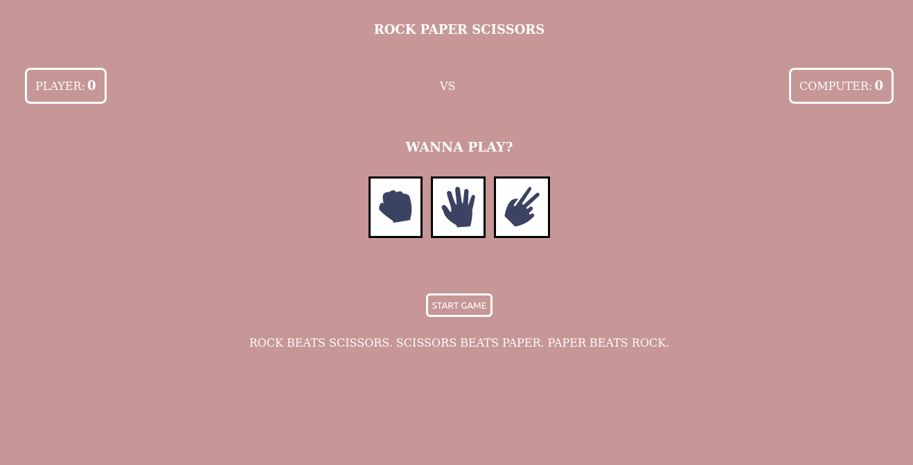

# project-rock-paper-scissors
Project: Rock Paper Scissors (TOP)

## Task:
    - Make a simple Implementation of the hand-game - "Rock Paper Scissors"
    - Add a UI for user to play the game
    - Declare winner when a user score (or computer) reaches 5 points
    - Add ability to end game

## Screenshot

    Here's an onload page of the game.

## Links
- Solution URL: [View Code](https://github.com/TonyFred-code/project-rock-paper-scissors)
- Live Site URL: [Live Preview](https://tonyfred-code.github.io/project-rock-paper-scissors/)

## My process
    - Started with no UI as first project iteration required
    - Gave a UI and refactored working logic over a period of 4 days
    - Have a couple of tinks to get around but its getting there
    - Used flexbox heavily for the UI layout (learnt more than i expected)

### Built with
    - Flexbox (extensively)

## Continued Development
    - Learn more layout techniques to properly solve the challenge from frontend Mentor
    - Need to better reduce unnecessary functions and repeated code logic

## Acknowledgements
    - Rock, Paper, Scissors (.svg)s from [Challenge on Frontend Mentor](https://www.frontendmentor.io/challenges/rock-paper-scissors-game-pTgwgvgH)
    - Project from [THE ODIN PROJECT](https://www.theodinproject.com/lessons/foundations-revisiting-rock-paper-scissors)
